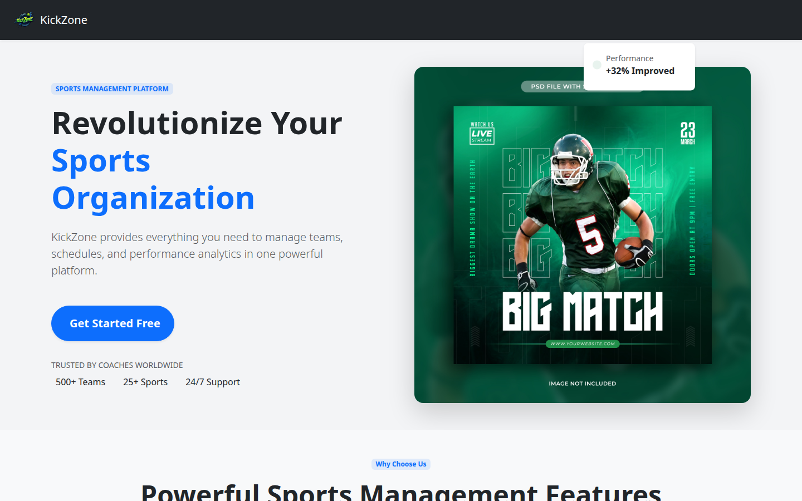
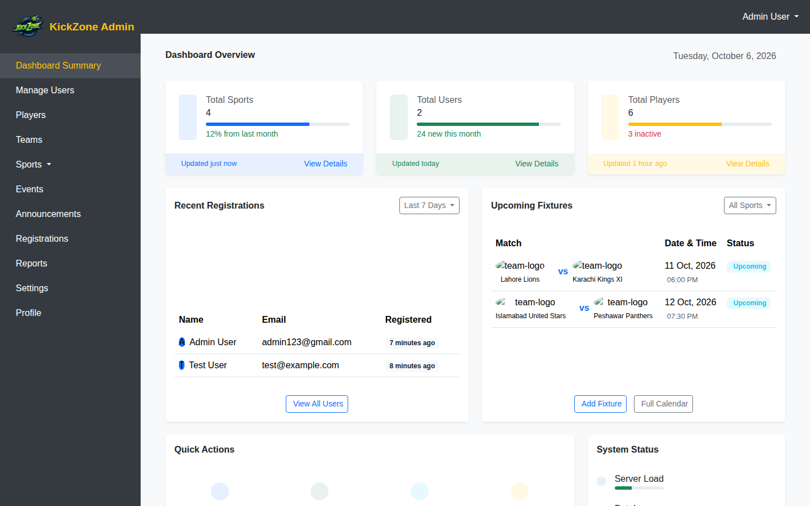
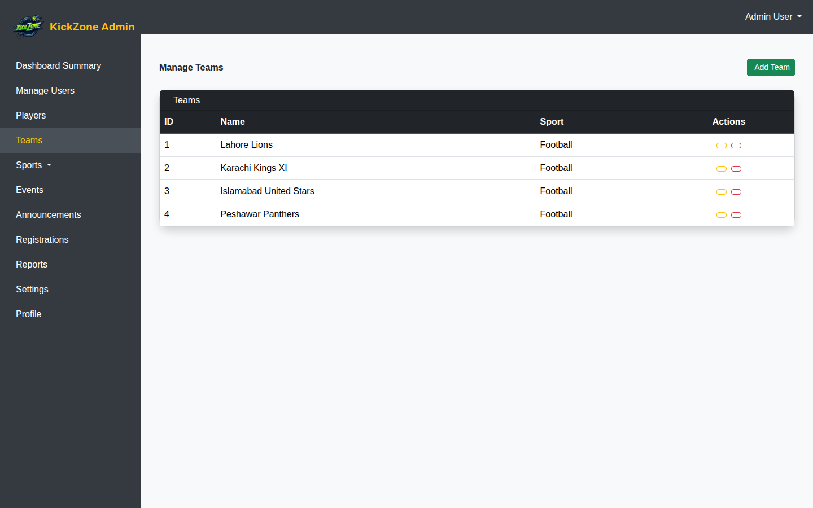
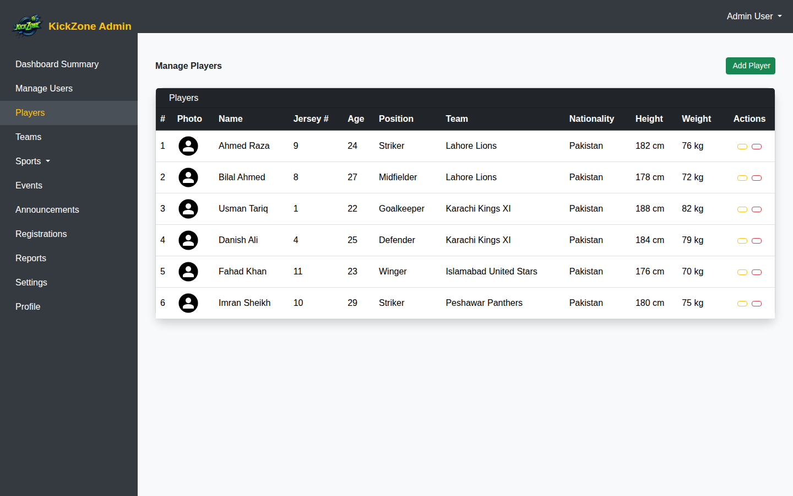
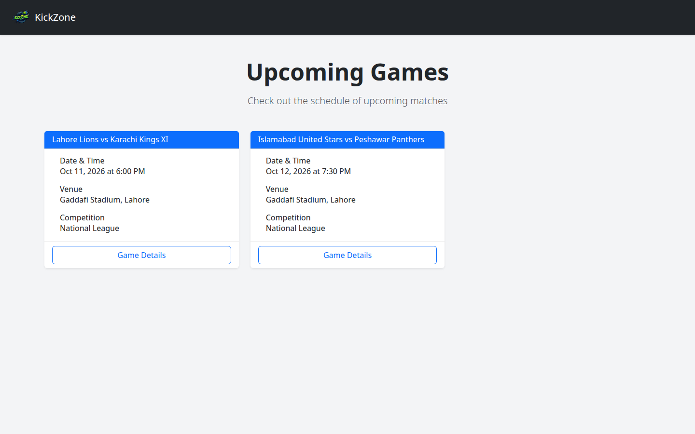

# 🏆 KickZone — Sports Management System


A complete web platform for managing sports organizations — teams, players, fixtures, events, announcements, and results — with a full admin panel and role-based access control. Built as a final-year university project.

> 🎮 **Live interactive demo:** https://kamran1272.github.io/portfolio/kickzone-demo/
> (static preview with sample data — login goes straight to the dashboard)

---

## 📖 About

KickZone centralizes everything a sports organization needs:

- 🏅 **Sports** — create, update, and categorize sports
- 👥 **Users** — admins, coaches, and general users with role-based access
- 🧑‍🤝‍🧑 **Players** — detailed profiles with team, position, jersey number, and physical stats
- 🏟️ **Teams** — linked to sports, with win/loss records and rankings
- 📅 **Fixtures & Games** — upcoming matches with dates, times, venues, and referees
- 📣 **Announcements & Events** — publish news and manage event registrations
- 📊 **Admin dashboard** — stats cards, recent registrations, upcoming fixtures, quick actions
- ✉️ **Contact form** — messages flow into the admin panel

---

## ✨ Features

- 🔐 Admin & user authentication (Laravel Breeze + custom `is_admin` middleware)
- 🛡️ Role-based access control — admin routes protected, users get their own portal
- 🔄 Full CRUD for sports, teams, players, fixtures, events, announcements, results, schedules
- 🖼️ Photo upload for players (Laravel filesystem, `storage/app/public`)
- 📊 Dashboard with stats, recent registrations, and upcoming fixtures
- 📝 Player registrations and contact messages managed from the admin panel
- 📱 Fully responsive (Bootstrap 5 + Tailwind CSS)

---

## 🛠️ Tech Stack

| Layer | Technology |
|---|---|
| Backend | Laravel 12 (PHP 8.2+) |
| Database | MySQL (SQLite for local dev) |
| Frontend | Blade, Bootstrap 5, Tailwind CSS, Alpine.js |
| Auth | Laravel Breeze + custom admin middleware |
| Build | Vite |

---

## 📸 Screenshots

### Homepage


### Admin Dashboard


### Team Management


### Player Management


### Upcoming Games


---

## ⚡ Getting Started

### Prerequisites
- PHP 8.2+, Composer
- Node.js 18+, npm
- MySQL (or SQLite for quick local setup)

### Installation

```bash
# 1. Clone
git clone https://github.com/kamran1272/kickzone.git
cd kickzone

# 2. Install dependencies
composer install
npm install

# 3. Environment
cp .env.example .env
php artisan key:generate

# 4. Database (SQLite quick start)
# set DB_CONNECTION=sqlite in .env, then:
touch database/database.sqlite
php artisan migrate --seed        # creates admin user
php artisan db:seed --class=DemoSeeder   # optional: sample sports data

# 5. Frontend assets
npm run build

# 6. Serve
php artisan serve
```

Visit 👉 http://127.0.0.1:8000

### Default credentials

| Role | Email | Password |
|---|---|---|
| Admin | `admin123@gmail.com` | `admin123` |
| User | `test@example.com` | `password` |

> For player photo uploads: `php artisan storage:link`

---

## 📁 Project Structure

```
app/
├── Http/Controllers/
│   ├── Admin/          # Dashboard, Sports, Teams, Players, Fixtures,
│   │                   # Events, Announcements, Results, Schedules,
│   │                   # Registrations, Reports, Users, Settings
│   ├── Auth/           # Breeze authentication
│   ├── ContactController.php
│   └── GameController.php
├── Models/             # Sport, Team, Player, Fixture, Game, Event,
│                       # Announcement, Result, Schedule, Registration, User
database/
├── migrations/         # 20 migrations incl. schema refinements
└── seeders/            # AdminSeeder, DemoSeeder (sample data)
resources/views/
├── admin/              # Admin panel (dashboard, CRUD pages)
├── auth/               # Login / register
└── user/               # Public portal (games, teams, players…)
routes/web.php          # Public, auth, and admin (is_admin) route groups
```

---

## 👨‍💻 Author

**Kamran Khan** — Full-Stack Developer (Laravel + React.js)

- 🌐 Portfolio: https://kamran1272.github.io/portfolio/
- 💼 LinkedIn: https://www.linkedin.com/in/kamran-khan-dev
- 🐙 GitHub: https://github.com/kamran1272

## 📜 License

MIT — see [LICENSE](LICENSE).
